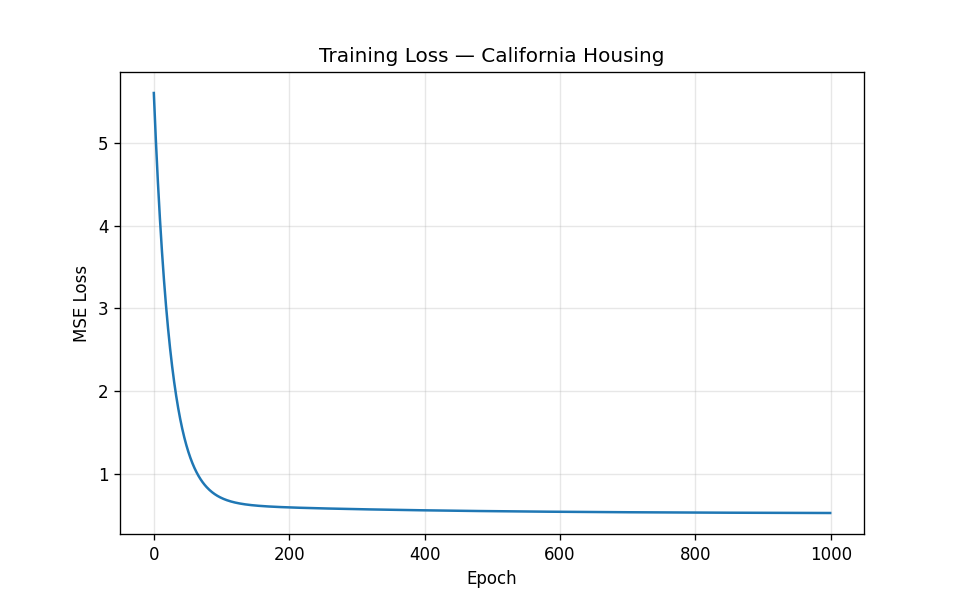

# Project 1: Linear Regression from Scratch

**Stack:** Python + NumPy + Matplotlib
**Time:** ~1 weekend
**Goal:** Understand gradient descent, loss functions, and what it means for a model to "learn."
**Status:** Complete

Trained a linear regression model from scratch in NumPy (no scikit-learn for the model — just for loading data) on the California Housing dataset.

## Results

**Final test MSE: 0.5624** (RMSE ≈ 0.75 → typical error of about $75K, on prices in $100K units)



Classic "hockey stick" curve — sharp drop in the first ~100 epochs as the model finds the rough answer, then a long fine-tuning tail down to the irreducible noise floor.

### What the model learned

After training, the 8 learned weights recovered real economic intuition — without anyone telling the model anything:

| Feature | Weight | Interpretation |
|---------|-------:|----------------|
| Median Income     | **+0.85** | strongest predictor — higher income → higher price |
| Average Bedrooms  | +0.26 | more bedrooms → higher price |
| House Age         | +0.15 | slightly older houses cost slightly more |
| Average Occupancy | -0.05 | denser households → slightly cheaper |
| Average Rooms     | -0.26 | counterintuitive (correlates with rural areas) |
| **Latitude**      | **-0.68** | northern California cheaper on average |
| **Longitude**     | **-0.65** | inland cheaper than coast |
| Population        | +0.00 | essentially irrelevant |

### Milestones & learning notes

Built progressively across 6 milestones. After each, I wrote a short reflection on what I learned, what clicked, and what tripped me up:

1. [Forward pass (`predict`)](./notes/milestone-1.md)
2. [Loss function (`mse_loss`)](./notes/milestone-2.md)
3. [Gradients (`compute_gradients`)](./notes/milestone-3.md)
4. [Training loop](./notes/milestone-4.md)
5. [Real housing data + normalization](./notes/milestone-5.md)
6. [Visualizing the loss curve](./notes/milestone-6.md)

### Run it yourself

```bash
cd 01-linear-regression
uv sync
uv run python train.py
```

---

This is the most important project on the ladder. Every neural network — including the LLM you'll build in Project 4 — is fundamentally a more elaborate version of what you're about to build. Take your time.

---

## Part 1: Theory (Read This First, No Code Yet)

### What is "learning" in machine learning?

A machine learning model is, at its core, a function with adjustable knobs (called **parameters** or **weights**). "Learning" means automatically tuning those knobs so that the function's outputs match the data we have.

For linear regression, the function is the simplest possible:

```
y = w * x + b
```

Where `x` is the input, `y` is the prediction, and `w` (weight) and `b` (bias) are the knobs. With many input features `x₁, x₂, ..., xₙ`:

```
y = w₁x₁ + w₂x₂ + ... + wₙxₙ + b
```

Or in matrix form, which is what you'll actually code:

```
y = X @ w + b
```

Where `X` is a matrix of inputs (one row per example, one column per feature), and `@` is matrix multiplication.

### Loss: how do we measure "wrong"?

We need a number that says how bad the predictions are. For regression, we use **Mean Squared Error (MSE)**:

```
loss = (1/n) * Σ (y_predicted - y_actual)²
```

We square the differences for two reasons: (1) it makes negative and positive errors both count as bad, and (2) it makes the math cleaner when we take derivatives.

### Gradient descent: the actual learning

Here's the key insight that powers all of deep learning:

> If we know how the loss changes when we nudge each weight up or down, we can nudge each weight in the direction that decreases the loss.

The "how the loss changes when we nudge a weight" is exactly what a **derivative** computes. Specifically, the **gradient** is the vector of all such derivatives.

Algorithm:
1. Make predictions with current weights
2. Compute the loss
3. Compute the gradient of the loss with respect to each weight
4. Subtract a small fraction of the gradient from each weight: `w = w - learning_rate * gradient`
5. Repeat thousands of times

That's it. That's the whole algorithm. Every neural network is this with more layers.

### The math you actually need

For MSE loss `L = (1/n) * Σ (ŷ - y)²` where `ŷ = X @ w + b`:

```
∂L/∂w = (2/n) * X.T @ (ŷ - y)
∂L/∂b = (2/n) * Σ (ŷ - y)
```

If you want, derive these by hand once before coding — it solidifies the understanding. Use the chain rule: differentiate the outer square, then the inner `(ŷ - y)`, then `ŷ` with respect to `w` or `b`.

If derivation feels heavy: it's fine to start with the formulas above and revisit the derivation later. The important thing is knowing *what* the gradient represents, not memorizing how to compute it.

### Recommended Watch Before Starting

- **3Blue1Brown — "Gradient descent, how neural networks learn"** (Chapter 2 of the neural networks series). 20 minutes, gives you the visual intuition.

---

## Part 2: Project Setup

### Environment

```bash
mkdir linear-regression-scratch
cd linear-regression-scratch
python -m venv .venv
source .venv/bin/activate   # On Windows: .venv\Scripts\activate
pip install numpy matplotlib pandas
```

### Dataset

Use the **California Housing dataset** (built into scikit-learn — but you'll only use sklearn to *load* the data, not for the model). Or generate synthetic data first to verify your code works.

```python
# Synthetic data — start here. Easier to debug.
import numpy as np
np.random.seed(42)
X = np.random.randn(200, 3)             # 200 examples, 3 features
true_w = np.array([2.0, -1.0, 0.5])
true_b = 0.3
y = X @ true_w + true_b + 0.1 * np.random.randn(200)   # add a bit of noise
```

If your model recovers `w` close to `[2.0, -1.0, 0.5]` and `b` close to `0.3`, your implementation works.

---

## Part 3: Implementation Milestones

Do these in order. Run the checkpoint after each one before moving on.

### Milestone 1: Forward pass

Write a function `predict(X, w, b)` that returns `X @ w + b`.

**Checkpoint:** Given `X` of shape `(200, 3)`, `w` of shape `(3,)`, and a scalar `b`, your function should return predictions of shape `(200,)`. Verify this with `assert predict(X, w, b).shape == (200,)`.

### Milestone 2: Loss function

Write `mse_loss(y_pred, y_true)` that returns a single number — the mean of squared differences.

**Checkpoint:** `mse_loss(y, y)` should return `0.0`. `mse_loss(np.array([1.0, 2.0]), np.array([2.0, 4.0]))` should return `2.5`.

### Milestone 3: Gradient computation

Write `compute_gradients(X, y_true, y_pred)` that returns `(grad_w, grad_b)` using the formulas above.

**Checkpoint:** Verify your gradients by **gradient checking** — comparing analytical gradients to numerical ones. (See "Common Bugs" below for the snippet.)

### Milestone 4: Training loop

Put it all together:

```python
w = np.zeros(n_features)
b = 0.0
learning_rate = 0.01
losses = []

for epoch in range(1000):
    y_pred = predict(X, w, b)
    loss = mse_loss(y_pred, y)
    grad_w, grad_b = compute_gradients(X, y, y_pred)
    w = w - learning_rate * grad_w
    b = b - learning_rate * grad_b
    losses.append(loss)

    if epoch % 100 == 0:
        print(f"Epoch {epoch}: loss = {loss:.4f}")
```

**Checkpoint:** On synthetic data, after training, `w` should be very close to `true_w` and `b` close to `true_b`. The loss curve (plotted with matplotlib) should decrease smoothly.

### Milestone 5: Real data

Load California Housing, split into train/test, normalize features (subtract mean, divide by std — important!), train, and report MSE on the test set.

**Checkpoint:** You should get test MSE around 0.5–0.6 on California Housing with normalized features. If it's huge (or NaN), revisit normalization.

### Milestone 6 (Bonus): Visualize

Plot the loss curve. For 1-feature regression on synthetic data, also plot the data points and your fitted line on the same axes. Watch the line snap into place as training progresses (animate it if you're feeling fancy).

---

## Part 4: Common Bugs

### "My loss is exploding to infinity / NaN"

- **Learning rate too high.** Try `0.001` or `0.0001`.
- **Features not normalized.** If one feature has values ~1000 and another ~0.001, gradient descent breaks. Normalize.

### "My loss is decreasing but then stuck high"

- **Learning rate too low.** Try larger.
- **Not enough epochs.** Try 5000.

### "My gradients seem wrong"

Use **gradient checking**:

```python
def numerical_gradient(f, w, eps=1e-5):
    grad = np.zeros_like(w)
    for i in range(len(w)):
        w_plus = w.copy(); w_plus[i] += eps
        w_minus = w.copy(); w_minus[i] -= eps
        grad[i] = (f(w_plus) - f(w_minus)) / (2 * eps)
    return grad

# Compare your analytical gradient to numerical_gradient
# They should match to ~5 decimal places
```

### "My weights all become identical"

You probably initialized them all to the same value and there's symmetry in the data. For linear regression this rarely matters, but flag it for future projects — it'll matter for neural nets.

---

## Tasks for Claude Code (Use Only When Stuck)

Copy these prompts when you've genuinely tried something and need help. Always paste your code along with the prompt.

### "I implemented gradients but my loss isn't decreasing"

> I implemented linear regression from scratch with NumPy. My loss is not decreasing during training — it stays flat or goes up. Here's my code: [paste]. Help me find the bug. Don't rewrite it for me — point at specific lines and explain what's wrong.

### "I want to derive the gradient by hand"

> Walk me through the derivation of `∂L/∂w` for MSE loss `L = (1/n) * Σ (Xw + b - y)²` step by step. Use the chain rule explicitly. After the derivation, I want to confirm my understanding by trying a small worked example with 2 examples and 2 features.

### "I want to add gradient checking"

> Help me write a `gradient_check` function that compares my analytical gradient to a numerical one. Explain the math behind why `(f(w+ε) - f(w-ε)) / (2ε)` approximates the derivative.

### "Why does normalization matter?"

> Explain *intuitively* why feature normalization matters for gradient descent. Use a 2D example where one feature ranges 0–1 and another ranges 0–1000. What does the loss landscape look like? Why does this break gradient descent?

---

## What You Should Walk Away Knowing

After Project 1 is complete, you should be able to answer these without looking anything up:

- What does a "weight" represent in an ML model?
- What is the loss function and why do we minimize it?
- What is a gradient, and why does subtracting it from weights decrease loss?
- Why does the learning rate matter? What goes wrong if it's too high or too low?
- Why do we normalize features?

If you can't answer any of these crisply, do not move to Project 2. Re-read the theory, try explaining it out loud, or write a blog post / README about what you built. Teaching it cements it.

---

## Stretch Goals (If You Have Extra Time)

- Implement **mini-batch** gradient descent (process 32 examples at a time instead of all 200).
- Implement **L2 regularization** (add `λ * ||w||²` to the loss). What does it do? Why?
- Try **polynomial features** — add `x²`, `x³` as columns. Now linear regression can fit curves. This is a useful preview for understanding why neural networks need nonlinearities.

---

**Next:** [Project 2 — Neural Network from Scratch](./02-neural-net-from-scratch.md)
