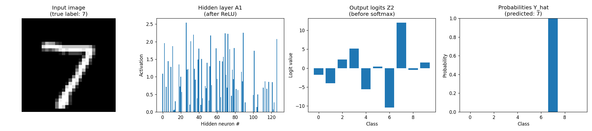

# Project 2: Neural Network from Scratch

**Stack:** Python + NumPy (still no PyTorch!)
**Time:** 1–2 weeks
**Goal:** Build a multi-layer neural network that classifies MNIST digits, with backpropagation implemented by hand.
**Status:** Complete

Built a 2-layer fully-connected neural network (`784 → 128 → 10`) in pure NumPy and trained it on MNIST. **Backpropagation derived and coded by hand**, then verified against numerical gradients to ~10⁻¹¹ precision. No PyTorch, no autograd — every gradient is computed manually.

## Results

**Test accuracy: 97.70%** (9,770 / 10,000 correct, 2.30% error rate)

| Metric | Value |
|--------|------:|
| Test accuracy | **97.70%** |
| Train accuracy (final epoch) | 98.39% |
| Train/test gap (overfitting check) | 0.69% — minimal |
| Initial loss (uniform random guess) | ~2.30 |
| Final loss | 0.06 |
| Training time | 10 epochs (~5 min on CPU) |

The 0.69% train/test gap means the network actually generalized — it didn't just memorize the training set.

### Forward pass on a single test image

This shows how a single MNIST digit flows through the network: input image → 128 hidden activations → 10 output logits → 10 probabilities (after softmax).



Notice how only a handful of hidden neurons "fire" strongly for any given input — the network is **sparse in practice**. Softmax then dramatically amplifies the largest logit into a confident prediction.

### What it gets wrong

The 230 misclassified test digits are mostly genuinely ambiguous handwriting — the kind of "is that a 4 or a 9?" cases a human would also struggle with at a glance:


### Per-milestone notes

I wrote a short reflection after each milestone — what I learned, what clicked, what I got stuck on:

1. [Forward pass (relu, softmax, forward)](./notes/milestone-1.md)
2. [Loss function (cross-entropy + one-hot)](./notes/milestone-2.md)
3. [Backpropagation (the hard one)](./notes/milestone-3.md)
4. [Training loop (mini-batches + He init)](./notes/milestone-4.md)
5. [Test-set evaluation](./notes/milestone-5.md)
6. [Visualizing the trained network](./notes/milestone-6.md)

### Run it yourself

```bash
cd 02-neural-net-from-scratch
uv sync
uv run python train.py
```

First run downloads MNIST (~10 MB, one-time). Subsequent runs train + evaluate + plot in ~5 minutes.

---

This is the project most people skip. Don't. Once you've coded backprop with raw NumPy, every PyTorch operation in later projects stops feeling like magic. You'll know exactly what `loss.backward()` is doing under the hood.

---

## Part 1: Theory

### From linear regression to neural networks

A neural network is just **stacked linear regressions with a twist**. The twist: between each linear layer, we apply a **nonlinear function** (called an "activation function").

Why the twist? Because stacking linear functions just gives you another linear function. `(W₂(W₁x + b₁) + b₂) = (W₂W₁)x + (W₂b₁ + b₂)`. No matter how many layers, you can't fit anything that's not a straight line. The nonlinearity is what gives neural networks their power.

A 2-layer network looks like:

```
hidden = ReLU(X @ W1 + b1)
output = hidden @ W2 + b2
```

Where `ReLU(z) = max(0, z)` — applied element-wise. That's it. That's a neural network.

### Why ReLU?

It's simple, computationally cheap, and works. Other choices exist (sigmoid, tanh) but ReLU is the modern default. The key property: it's nonlinear, which is what we need.

### Classification: from regression to softmax

For MNIST, we need to predict one of 10 classes (digits 0–9), not a single number. Two changes:

1. **Output 10 numbers, not 1.** Last layer outputs a vector of "logits" of size 10.
2. **Softmax + Cross-Entropy loss** instead of MSE.

**Softmax** turns 10 raw scores into a probability distribution (10 numbers that sum to 1):

```
softmax(z)_i = exp(z_i) / Σ_j exp(z_j)
```

**Cross-Entropy loss** measures how bad the predicted probability distribution is compared to the true one:

```
loss = -log(p_correct_class)
```

If the model gives 99% probability to the correct class, loss is tiny (`-log(0.99) ≈ 0.01`). If it gives 1%, loss is huge (`-log(0.01) ≈ 4.6`). The model is incentivized to give high probability to the correct class.

### Backpropagation: the big deal

Backprop is just the chain rule from calculus, applied carefully to compute gradients layer-by-layer, working backwards from the output. Here's the intuition:

> If you wiggle a weight in layer 1, it changes the output of layer 1, which changes the input to layer 2, which changes the input to layer 3, ..., which changes the loss. The chain rule lets us multiply all these "rates of change" together to get the rate of change of loss with respect to that weight.

For our 2-layer network:

```
Forward:
  Z1 = X @ W1 + b1
  A1 = ReLU(Z1)
  Z2 = A1 @ W2 + b2
  Y_hat = softmax(Z2)
  loss = cross_entropy(Y_hat, Y)

Backward (the gradients to compute):
  dZ2 = Y_hat - Y                  # convenient shortcut: derivative of softmax + cross-entropy
  dW2 = A1.T @ dZ2 / batch_size
  db2 = mean(dZ2, axis=0)
  dA1 = dZ2 @ W2.T
  dZ1 = dA1 * (Z1 > 0)             # derivative of ReLU is 1 if z > 0 else 0
  dW1 = X.T @ dZ1 / batch_size
  db1 = mean(dZ1, axis=0)
```

You'll derive these yourself (or follow the derivation closely). The "softmax + cross-entropy combine into a clean `Y_hat - Y`" trick is one of those small miracles that makes the math elegant.

### Mini-batch training

Don't compute gradients on all 60,000 MNIST images at once (slow, memory-heavy) or one at a time (noisy gradients). Use **mini-batches** of 32 or 64. Common choice: 64.

### Recommended Watch Before Starting

- **Andrej Karpathy — "The spelled-out intro to neural networks and backpropagation: building micrograd"** (YouTube). 2.5 hours. This is *the* video for understanding backprop. Watch it. Possibly twice. It's the single highest-value resource on this entire ladder.
- **3Blue1Brown — Chapters 3 and 4** of the neural network series, on backprop.

---

## Part 2: Project Setup

```bash
mkdir nn-from-scratch
cd nn-from-scratch
python -m venv .venv
source .venv/bin/activate
pip install numpy matplotlib scikit-learn
```

### Loading MNIST

Use scikit-learn (just for loading — your model will still be pure NumPy):

```python
from sklearn.datasets import fetch_openml
mnist = fetch_openml('mnist_784', version=1, as_frame=False)
X = mnist.data.astype(np.float32) / 255.0   # normalize to [0, 1]
y = mnist.target.astype(int)

# Train/test split
X_train, X_test = X[:60000], X[60000:]
y_train, y_test = y[:60000], y[60000:]
```

You'll also need **one-hot encoding** for `y`:

```python
def one_hot(y, num_classes=10):
    out = np.zeros((len(y), num_classes))
    out[np.arange(len(y)), y] = 1
    return out
```

---

## Part 3: Implementation Milestones

### Milestone 1: Forward pass

Write functions for:

- `relu(z)` — element-wise max with 0
- `softmax(z)` — convert logits to probabilities. **Important:** subtract `z.max()` before exp for numerical stability.
- `forward(X, W1, b1, W2, b2)` — returns intermediates `(Z1, A1, Z2, Y_hat)`

**Checkpoint:** Initialize weights with `np.random.randn(...) * 0.01`. With random weights, your forward pass should produce a probability distribution per row of `X` (each row sums to ~1).

### Milestone 2: Loss

Write `cross_entropy(Y_hat, Y_true_onehot)` returning a scalar. **Important:** clip `Y_hat` to `[1e-7, 1 - 1e-7]` before taking log to avoid `log(0) = -infinity`.

**Checkpoint:** Loss on a fresh untrained model should be approximately `-log(1/10) ≈ 2.30`. Why? Because random predictions are ~10% probability for the correct class.

### Milestone 3: Backward pass

Implement the gradients above. This is the hardest milestone. Take it slow.

**Checkpoint: Gradient checking.** Implement numerical gradient checking (same technique as Project 1) and verify your analytical gradients match for at least one weight in `W1` and one in `W2`. They should match to ~5 decimal places. **Do not move on until this passes.** It's the most common place where bugs hide.

### Milestone 4: Training loop

```python
W1 = np.random.randn(784, 128) * np.sqrt(2 / 784)   # He initialization
b1 = np.zeros(128)
W2 = np.random.randn(128, 10) * np.sqrt(2 / 128)
b2 = np.zeros(10)

batch_size = 64
learning_rate = 0.1
epochs = 10

for epoch in range(epochs):
    # Shuffle training data each epoch
    perm = np.random.permutation(len(X_train))
    X_shuf, y_shuf = X_train[perm], y_train[perm]

    for i in range(0, len(X_train), batch_size):
        X_batch = X_shuf[i:i+batch_size]
        y_batch = one_hot(y_shuf[i:i+batch_size])

        # Forward, loss, backward, update
        # ...
```

**Checkpoint:** After 1 epoch, training accuracy should be >90%. After 10 epochs, test accuracy should be >95%. If it's stuck at 10% (chance), something is broken in backprop.

### Milestone 5: Evaluate

Compute test accuracy. Also: pick 10 misclassified images and look at them. Often the errors are genuinely ambiguous (a 4 that looks like a 9). This builds intuition.

### Milestone 6 (Bonus): Visualize what the network learned

Each row of `W1` is a 784-dim vector that can be reshaped to 28×28 and shown as an image. These are the "feature detectors" the first layer learned. Plot 16 of them in a grid. They often look like edge detectors, blob detectors, or stroke fragments — early evidence of how networks build up complexity.

---

## Part 4: Common Bugs

### "My loss starts at 2.3 and never decreases"

- **Bug in backprop.** Re-run gradient checking on every gradient (`dW1`, `db1`, `dW2`, `db2`). One of them is wrong.
- **Learning rate too low.** Try `0.1` or `0.5`.

### "My loss explodes to NaN after a few iterations"

- **Numerical instability in softmax.** Make sure you subtract `z.max(axis=1, keepdims=True)` before exp.
- **Numerical instability in log.** Clip predictions to `[1e-7, 1 - 1e-7]` before taking log.
- **Learning rate too high.** Try `0.01`.

### "Accuracy is stuck at 10%"

- **All predictions identical.** Check weight initialization — if all weights are zero, all neurons compute the same thing and stay symmetric forever. Use random init.
- **Forgot to apply ReLU.** A network without nonlinearity collapses to linear regression and can't beat ~10% on MNIST cleanly.

### "Training accuracy is 99% but test accuracy is 80%"

- **Overfitting.** Your network memorized the training set. Solutions: smaller network, more data, regularization, dropout. (You don't need to fix this in v1, but notice it.)

### "Shapes don't match"

- Print `.shape` everywhere. Build a shape diagram on paper before coding. Most bugs in NumPy ML code are shape mismatches.

---

## Tasks for Claude Code (When Stuck)

### "My gradient check is failing"

> I'm building a neural network from scratch and my gradient check is failing for `dW1`. My analytical and numerical gradients don't match. Here's my forward and backward code: [paste]. Help me find the bug — don't rewrite, point at the line.

### "I want to derive the softmax + cross-entropy gradient"

> Walk me through deriving `dZ2 = Y_hat - Y` from softmax and cross-entropy. I want to understand why these two functions combine into such a clean gradient. Use the chain rule explicitly.

### "Explain He initialization"

> I'm initializing weights with `np.random.randn(...) * np.sqrt(2 / fan_in)`. What is "He initialization" and why does it work better than just `randn(...) * 0.01`? Connect it to the problem of vanishing/exploding activations through layers.

### "Why does softmax need numerical stabilization?"

> Explain the numerical stability trick of subtracting `z.max()` before applying exp in softmax. Show me what happens *without* the trick when one logit is, say, 1000.

---

## What You Should Walk Away Knowing

- What is an activation function and why is it necessary?
- How does softmax convert logits to probabilities?
- Why is cross-entropy a good loss for classification?
- What is backpropagation, in your own words? (Hint: chain rule + cached intermediates from forward pass)
- Why does mini-batch training work better than full-batch or single-example?
- What's the difference between training accuracy and test accuracy, and why does the gap matter?

If you can crisply explain backprop to an imaginary friend (or write a blog post), you're ready for Project 3.

---

## Stretch Goals

- **Add dropout** — randomly zero out 50% of hidden activations during training. Watch the train/test gap shrink.
- **Try a 3-layer network.** Does it help? Does it hurt? Why?
- **Implement Adam optimizer** instead of plain SGD. Adam is the default optimizer in modern deep learning. Implementing it once cements what optimizers actually do.
- **Visualize learning** — save the weight visualization every epoch and make a GIF.

---

**Previous:** [Project 1 — Linear Regression](./01-linear-regression.md)
**Next:** [Project 3 — PyTorch + CNN](./03-pytorch-cnn.md)
