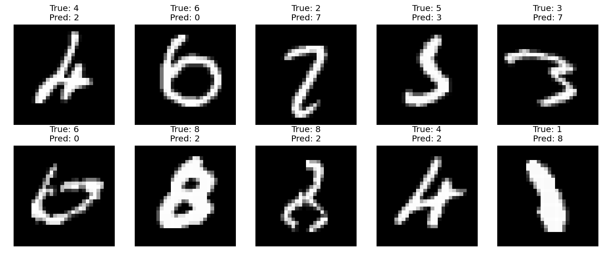

# Milestone 5 — Evaluation on the test set

## What I built

An evaluation of the trained model and showing some of the miss interpreted numbers

```python
# Forward pass on the entire test set (10,000 images, no batching needed for inference)
_, _, _, Y_hat_test = forward(X_test, W1, b1, W2, b2)
predictions = Y_hat_test.argmax(axis=1)

test_accuracy = (predictions == y_test).mean()
print(f"Test accuracy: {test_accuracy:.4f}")
```

Result: **97.70% test accuracy** (9770 / 10000 correct, 230 wrong).

## New concepts I learned

- **Test accuracy (and why it matters more than train accuracy)**: It matters more becaues it really shows that the model learned because these are images it has never seen before .
- **The train/test gap as a measure of overfitting**: In our case they are really close with shows that it was a good healthy training run. if the gap was big it would indiacate that the model just memorized the training data instead of really learning how to identify numbers
- **`argmax` on probabilities to get predicted class**: It just takes the highest probabilty of the row and takes that as the classification
- **Looking at misclassified images for intuition**: → We see that the numbers it missclassified are really sloppy written numbers that a human could also missclassify on a quick look. ther is no obvius number where i was like "wow i wonder why it didnt get that one".

  

## What clicked / surprised me

How after all this hard work and the concepts that felt so diffucult in the beginning in the end it does not feel as magical anymore.

## What I got stuck on

Nothing really
