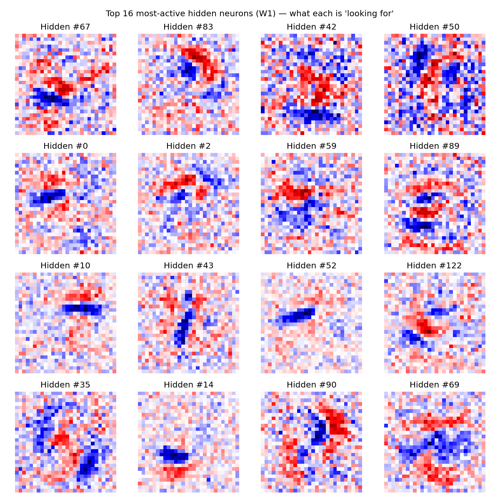
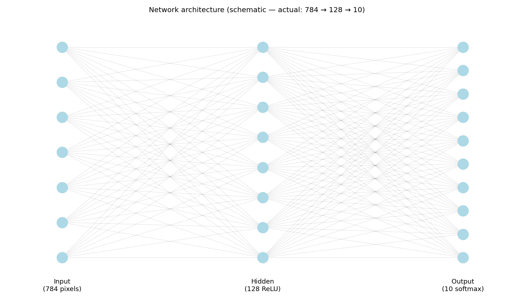

# Milestone 6 — Visualizing the trained network

## What I built

Three visualizations of the trained model: the first-layer weight patterns reshaped back to 28×28, a forward-pass plot for a single test image, and a schematic of the network architecture.

## New concepts I learned

- **Visualizing W1 columns as 28×28 weight patterns**: Each of the 128 hidden neurons has 784 weights (one per input pixel). If I take one column of W1 and reshape it back to 28×28, I get a picture of what that neuron is "looking for" in the input. Bright pixels = this pixel makes the neuron fire more, dark pixels = inhibit it.

  

- **Why FC network visualizations look noisy (vs CNNs)**: The patterns mostly looked like noise to me, with only hints of structure. This is normal for fully-connected networks — they distribute their learning across many neurons in non-obvious ways. Convolutional networks (Project 3) will produce much cleaner edge / stroke detectors because they're designed for local features.

- **The forward-pass visualization (input → A1 → Z2 → Y_hat)**: Picked one test image and plotted four panels side by side — the input digit, the 128 hidden activations as a bar chart, the 10 raw logits, and the 10 final probabilities. This was the visualization that actually made "how data flows through the model" click. Most hidden neurons stay near zero for a given input — only a handful "fire" for any specific digit. Then softmax dramatically amplifies the largest logit into a confident probability.

  

- **Why architecture diagrams use simplified node counts**: The real network has 784 → 128 → 10 nodes, which is way too many to draw legibly. 784 dots in a column is unreadable, and 784 × 128 = 100,352 connection lines would be a solid black blob. So schematics show a few representative circles per layer — the actual counts go in the title.

  

## What clicked / surprised me

The forward-pass visualization was the moment "how the input flows through the model" finally clicked. Seeing the input image, the bar chart of hidden activations, and the output probabilities side by side made it concrete in a way the W1 weight patterns didn't.

Also surprising: how few hidden neurons actually "fire" strongly for any one image. The model is sparse in practice — most neurons stay quiet most of the time.

## What I got stuck on

I was honestly disappointed by the W1 weight patterns. I expected the clean edge detectors I'd seen in ML blog posts and instead got mostly noise with subtle hints of structure. Took me a while to realize this isn't a bug — it's just what fully-connected networks look like when visualized. CNNs are the architecture that produces the textbook-clean filters; mine just isn't built that way.
